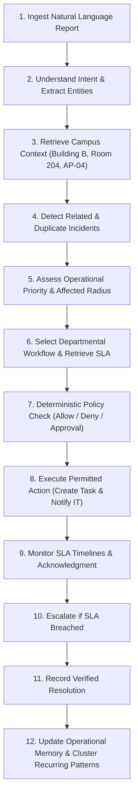

# Paraxis AI

> **The Intelligent Operational Layer for Modern Campuses.**
> *"See what is happening. Understand what matters. Coordinate what happens next."*

Paraxis AI is derived from Greek terminology associated with *praxis* (acting, doing, practical execution). It is **not** another generic college ERP or ticketing system. Instead, it is an intelligent operational substrate that sits above fragmented campus workflows to detect problems, understand operational context, coordinate cross-functional responses, monitor outcomes, reduce waste, and surface recurring operational patterns.

---

## 1. Product Pillars & North-Star Workflow

Paraxis AI connects four critical operational domains:

1. **AI Campus Issue & Maintenance** *(First Vertical Slice / North Star)*
2. **Smart Attendance & Communication**
3. **Smart Hostel & Mess Operations**
4. **Safety, Emergency & Trust**

### The North-Star Operational Flow

When a student reports:
```
"Wi-Fi is down in Block B, Room 204."
```

Paraxis AI does not create an uncontextualized, dead ticket. It coordinates an active operational loop:



---

## 2. Architectural North Star

Paraxis AI is architected as a modular, cloud-agnostic monorepo with a strict, non-negotiable boundary between canonical domain business state and autonomous agent reasoning.

```
                         PARAXIS AI
                              |
             +----------------+----------------+
             |                                 |
        CORE PLATFORM                    INTELLIGENCE
           Django                         FastAPI
             |                                 |
       Domain / Auth                  Agents / RAG / AI
       Business Logic                  LangGraph / Tools
       APIs / Audit                    Evaluations
             |                                 |
             +----------------+----------------+
                              |
                    PostgreSQL + pgvector
                              |
                            Redis
                              |
                    External Integrations
```

### The Non-Negotiable Boundary

| Dimension | Django Core Platform (`apps/core`) | FastAPI Intelligence (`apps/intelligence`) |
| :--- | :--- | :--- |
| **Primary Responsibility** | Canonical domain state, tenancy, persistence, audit | Agent orchestration, reasoning workflows, semantic search |
| **Framework** | Django 5+ & Django REST Framework | FastAPI & LangGraph |
| **Ownership** | Organizations, Campuses, Users, Roles, Incidents, Tasks, SLAs, Approvals | Agent state graph, model routing, embeddings, tool registry |
| **Authority** | **Sole persistent source of truth**. Authorizes and commits state | **Proposes actions**. Never directly mutates persistent state |
| **Database Access** | Full read/write relational ORM access | Read-only vector search / writes gated through Core internal APIs |

> [!CRITICAL]
> **The LLM is NEVER the source of truth.**
> The AI *proposes*. The domain layer *validates*. The policy engine *authorizes*. The system *executes*.

---

## 3. Monorepo Directory Structure

```
paraxis-ai/
├── apps/
│   ├── web/                     # Next.js 14+ (App Router, TypeScript, Tailwind, shadcn/ui)
│   ├── core/                    # Django Core (DRF, PostgreSQL, Canonical Domain Models)
│   └── intelligence/            # FastAPI Intelligence (LangGraph, AI Gateway, RAG)
├── packages/
│   ├── contracts/               # Shared Pydantic schemas, OpenAPI specs & event contracts
│   ├── ui/                      # Shared design tokens & UI components
│   ├── config/                  # Shared linting, TSConfig, and formatting settings
│   └── sdk/                     # Typed client SDKs for internal service communication
├── infrastructure/
│   ├── docker/                  # Dockerfiles and container configurations
│   ├── postgres/                # PostgreSQL init scripts (pgvector & uuid-ossp)
│   ├── redis/                   # Redis configuration templates
│   └── deployment/              # Cloud-agnostic deployment manifests
├── docs/
│   ├── product/                 # Charter, PRD, Personas, Journeys, Feature Map, Design
│   ├── architecture/            # HLD, LLD, Domain Model, Data Architecture, Realtime
│   ├── agents/                  # LangGraph state model, Tool contracts, Policy engine
│   ├── security/                # Threat model, Tenant isolation, AI safety, Authorization
│   ├── api/                     # Guidelines, Error envelopes, Versioning, Auth specs
│   ├── testing/                 # Test strategy, Unit, Integration, E2E, AI Evals
│   ├── operations/              # Local dev, Observability, Runbooks, Disaster recovery
│   └── decisions/               # Architecture Decision Records (ADR-001 through ADR-009)
├── tests/
│   ├── contract/                # Cross-service contract and schema tests
│   ├── integration/             # Integration tests for Core, DB, Redis, Intelligence
│   ├── e2e/                     # Playwright browser end-to-end user journeys
│   ├── evaluation/              # AI offline benchmarks and accuracy evaluations
│   └── fixtures/                # Deterministic campus and operational datasets
├── scripts/                     # Developer utilities and verification harnesses
├── .github/workflows/           # CI/CD automation pipelines
├── AGENTS.md                    # Invariant instructions for autonomous coding agents
├── CONTRIBUTING.md              # Engineering guidelines, PR process & Definition of Done
├── SECURITY.md                  # Security policies, isolation guarantees & reporting
├── Makefile                     # Developer lifecycle commands
├── docker-compose.yml           # Local foundation services (PostgreSQL 16 pgvector + Redis 7)
└── .env.example                 # Comprehensive environment variable template
```

---

## 4. Quickstart Guide (Local Development)

### Prerequisites
- Python `3.12+` (System verified: `3.14.6`)
- Node.js `20+` (System verified: `v26.4.0`)
- Docker & Docker Compose (`v5.3+`)

### 1. Initialize Environment
```bash
# Clone and setup environment template
make setup
```

### 2. Launch Local Foundation Infrastructure
```bash
# Start PostgreSQL (pgvector) and Redis in background
make docker-up

# Verify running container health
docker compose ps
```

### 3. Verify Foundation Integrity
```bash
# Run comprehensive architecture & foundation verification
make verify-foundation
```

---

## 5. Engineering Principles & Quality Assurance

- **Multi-Tenancy by Design**: Every operational resource is strictly partitioned under an `Organization -> Campus` hierarchy. Tenant identity is extracted exclusively from authenticated tokens—never trusted from client payloads.
- **Tool Safety**: Agents operate exclusively via typed, registered tools with strict parameter schemas. Unrestricted shell, raw SQL, or arbitrary HTTP egress is strictly prohibited.
- **Deterministic Policy Engine**: Every consequential action proposed by an LLM is routed through a three-state deterministic policy check:
  - `ALLOW` (Routine, safe, idempotent actions)
  - `REQUIRE_HUMAN_APPROVAL` (Sensitive, financial, disciplinary, or exceptional communications)
  - `DENY` (Violations of campus boundaries, safety policies, or tenant constraints)
- **Deep Observability**: Every operation is traceable via unified correlation headers: `request_id`, `trace_id`, `incident_id`, `agent_run_id`, and `tool_call_id`.

---

## 6. Project Roadmap

| Phase | Milestone | Scope / Target |
| :--- | :--- | :--- |
| **Phase 0** | **Foundation & Architecture** | Complete documentation, ADRs, monorepo scaffolding, Docker compose. *(Current)* |
| **Phase 1** | **Identity & Tenancy** | Organizations, Campuses, User authentication, RBAC, tenant enforcement. |
| **Phase 2** | **Incident Domain** | Canonical incident models, task creation, SLA engines, event log. |
| **Phase 3** | **Incident Intelligence** | LangGraph agent workflow, operational RAG, duplicate detection, tool safety. |
| **Phase 4** | **Command Center UI** | Next.js operations dashboard, timeline, agent evidence cards, approval flows. |
| **Phase 5** | **Specialized Domains** | Attendance anomalies, Hostel/Mess forecasting, Safety cases. |
| **Phase 6** | **Operational Memory** | Temporal pattern mining, cross-incident recurring issue detection. |

---

## 7. License & Governance

Internal Hackathon to Enterprise Incubation. Refer to [AGENTS.md](file:///home/cholan0415/Projects/paraxis-ai/AGENTS.md) for coding agent rules and [CONTRIBUTING.md](file:///home/cholan0415/Projects/paraxis-ai/CONTRIBUTING.md) for engineering standards.