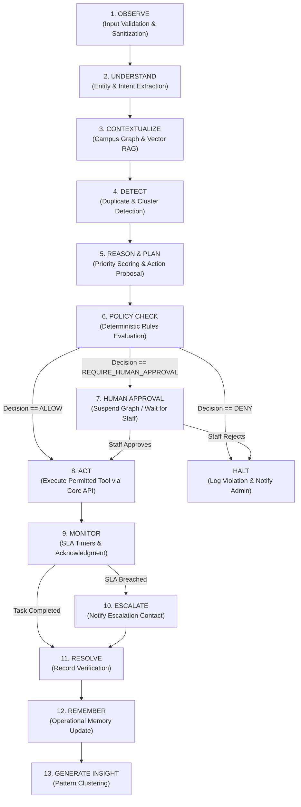

# Agent Architecture & Workflow Engine — Paraxis AI

> **Purpose**: LangGraph stateful orchestration, node responsibilities, conditional routing, and deterministic execution guarantees.

---

## 1. Single Orchestrated Workflow Philosophy

Paraxis AI rejects uncoordinated "multi-agent swarms" that converse without deterministic boundaries. Instead, we implement a **single, stateful LangGraph workflow** composed of specialized functional nodes.

---

## 2. Functional Node Responsibilities

1. **OBSERVE (`observe.py`)**:
   - Ingests raw incident text and reporter metadata.
   - Quarantines untrusted text to prevent prompt injection from overriding instructions.
2. **UNDERSTAND (`understand.py`)**:
   - Extracts entity candidates: Building, Room, Asset, Problem Description, Urgency cues.
   - Outputs strict Pydantic `ExtractedEntities` object.
3. **CONTEXTUALIZE (`contextualize.py`)**:
   - Queries Django Core to match physical entities (Building B -> Room 204 -> AP-04).
   - Retrieves active room schedules (e.g., "Class starts in 5 minutes").
4. **DETECT (`detect.py`)**:
   - Performs vector similarity search over currently open incidents within the same building/department.
   - If similarity > 0.85, flags incident as `DUPLICATE_CANDIDATE`.
5. **REASON & PLAN (`plan.py`)**:
   - Evaluates severity, blast radius, and room impact.
   - Formulates a proposed operational action (e.g., `CREATE_TASK`, priority: `HIGH`).
6. **POLICY CHECK (`policy_gate.py`)**:
   - Deterministically evaluates the proposed action against campus rules (see [policy-engine.md](file:///home/cholan0415/Projects/paraxis-ai/docs/agents/policy-engine.md)).
7. **HUMAN APPROVAL (`human_gate.py`)**:
   - Suspends the LangGraph thread, persists state in Redis/Postgres checkpoint, and surfaces an interactive approval card in the Command Center.
8. **ACT (`act.py`)**:
   - Calls Django Core internal APIs (`/internal/v1/tasks/`) to commit transactional work orders.
9. **MONITOR & ESCALATE (`monitor.py`, `escalate.py`)**:
   - Tracks technician acknowledgment and resolution timestamps against SLA policies.
10. **REMEMBER & INSIGHT (`memory.py`, `insight.py`)**:
    - Generates embeddings of the resolved incident and checks for multi-week failure clusters.
