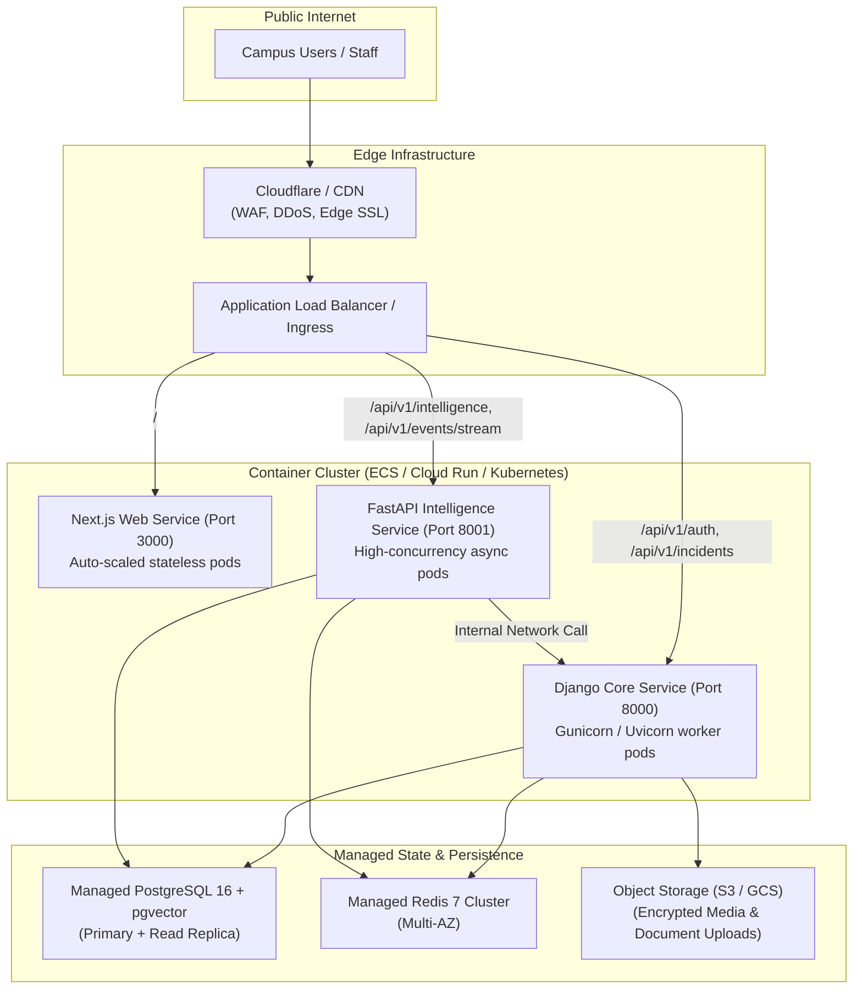

# Deployment Architecture — Paraxis AI

> **Purpose**: Infrastructure topology, local containerization, staging/production hosting models, and cloud-agnostic deployment strategy.

---

## 1. Local Development Topology (Docker Compose)

For local development and hackathon evaluation, Paraxis AI runs with minimal operational friction:
- **`postgres` container**: `pgvector/pgvector:pg16` on host port `5432` with named volume `postgres_data` and automatic init script (`infrastructure/postgres/init-pgvector.sql`).
- **`redis` container**: `redis:7-alpine` on host port `6379` with named volume `redis_data`.
- **Applications**: Run either natively via hot-reloading dev servers or in optional containerized profiles:
  - `backend/core`: `python manage.py runserver 0.0.0.0:8000`
  - `backend/intelligence`: `uvicorn main:app --port 8001 --reload`
  - `frontend`: `npm run dev` on port `3000`

---

## 2. Enterprise Cloud-Agnostic Topology (Target Production)

Paraxis AI is intentionally designed to avoid vendor lock-in and runs cleanly on any standard container platform (AWS, GCP, Azure, or private cloud):

---

## 3. High Availability & Scaling Characteristics

1. **Next.js Web**: Fully stateless; scales horizontally based on CPU / HTTP request counts.
2. **Django Core**: Stateless application nodes. Persistent state lives in PostgreSQL and Redis.
3. **FastAPI Intelligence**: I/O-bound async workers communicating with LLM providers; horizontally scales based on active agent concurrency.
4. **PostgreSQL + pgvector**: Scaled vertically for memory and IOPS; read replicas used for analytics and read-heavy reporting queries.
