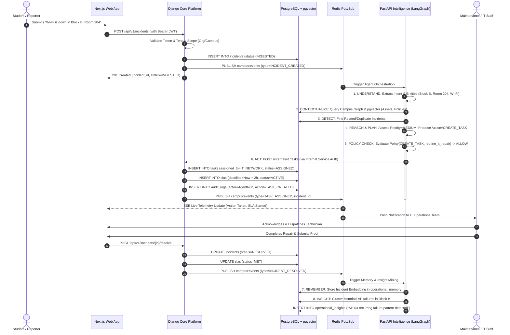
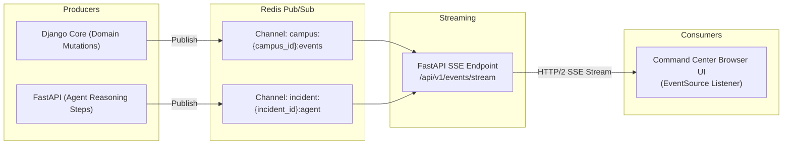

# High-Level Design (HLD) — Paraxis AI

> **Purpose**: Detailed component interactions, end-to-end data flows, lifecycle state machines, and failure boundaries for Paraxis AI.

---

## 1. System Interaction Topology

---

## 2. Core Request & Authentication Flows

### 2.1 User Authentication Flow
1. User logs in via `/api/v1/auth/token/` with credentials.
2. Django Core verifies credentials against `User` table, checking active status and assigned `Role`.
3. Django Core returns signed RS256/HS256 JWT containing:
   - `sub`: User UUID
   - `org_id`: Organization UUID
   - `campus_id`: Active Campus UUID
   - `roles`: Assigned roles (`STUDENT`, `STAFF`, `ADMIN`, etc.)
   - `exp`: Short-lived expiration (15 minutes).
4. Web client attaches this token in `Authorization: Bearer <token>` for all subsequent requests.

### 2.2 Service-to-Service Authentication Flow
1. FastAPI Intelligence calls Django Core internal endpoints (`/internal/v1/*`) to execute approved domain mutations.
2. The request includes:
   - `X-Internal-Service-Key`: Pre-shared high-entropy cryptographic service secret.
   - `X-Agent-Run-ID`: LangGraph execution identifier.
   - `X-Actor-User-ID`: The original user on whose behalf the agent is running.
3. Django Core's `InternalServiceAuthentication` middleware verifies the service key and sets the request context.

---

## 3. Real-Time Event & Telemetry Architecture

---

## 4. Failure Boundaries & Resilience

| Boundary | Failure Mode | Resilience Strategy | Impact |
| :--- | :--- | :--- | :--- |
| **AI Provider Outage** | External LLM API (Google/OpenAI) times out or returns 500 | Automatic fallback to secondary provider or MockModelAdapter; mark agent run as DEGRADED; fallback to rule-based triage. | Incidents still created; routing falls back to default department queue. |
| **FastAPI Down** | Intelligence service crashes or restarts | Django Core operates independently; incidents persist with status `PENDING_AGENT`; background retry reconciles unprocessed events. | Zero data loss; automated triage delayed until recovery. |
| **Redis Down** | Cache & Pub/Sub unavailable | Core falls back to direct database reads; live SSE streaming temporarily disables; UI gracefully reverts to polling. | Realtime UI updates delayed; core operations intact. |
| **PostgreSQL Down** | Primary database unavailable | Monitored health checks fail; load balancer halts traffic; persistent volume preserves data; read replica failover in enterprise setup. | System enters 503 Maintenance state. |

---

## 5. Deployment Boundaries

- **Development**: All services orchestrated locally via `docker-compose.yml` (`postgres`, `redis`) with native runtimes (`apps/core` on 8000, `apps/intelligence` on 8001, `apps/web` on 3000).
- **Production / Enterprise**: Cloud-agnostic containerized deployment (e.g., AWS ECS, GCP Cloud Run, or generic Kubernetes) with managed PostgreSQL 16 (with pgvector) and managed Redis.
