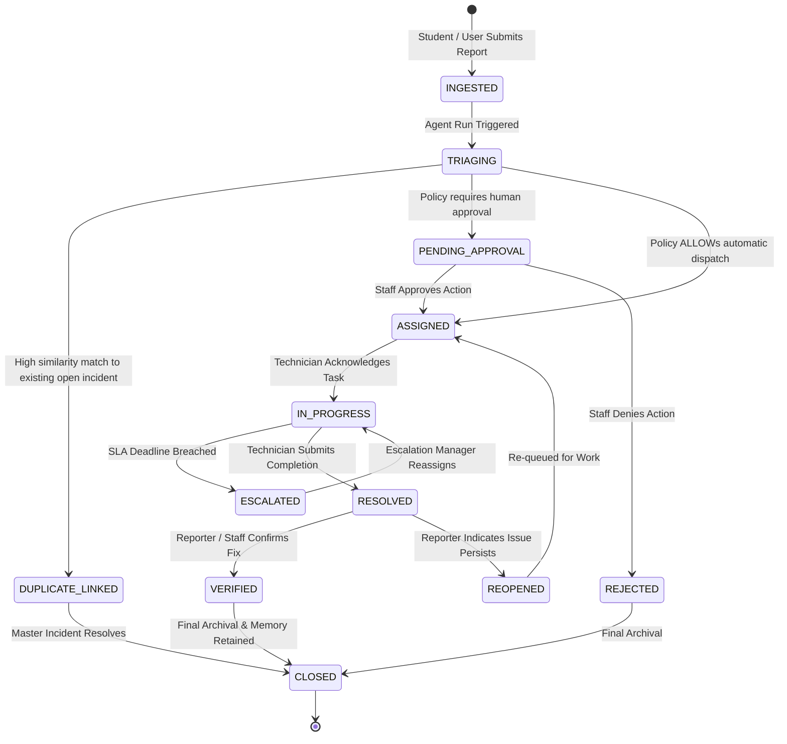

# Low-Level Design (LLD) — Paraxis AI

> **Purpose**: Internal component designs, state machine transitions, class/schema definitions, and operational protocols for Paraxis AI.

---

## 1. Application Module Architecture

### 1.1 Django Core (`apps/core/`)
```
apps/core/
├── manage.py
├── config/
│   ├── settings.py              # Environment-backed Django configuration
│   ├── urls.py                  # Global URL routing
│   ├── wsgi.py                  # WSGI entrypoint
│   └── asgi.py                  # ASGI entrypoint
├── core/
│   ├── middleware/
│   │   ├── tenancy.py           # Extracts & verifies tenant context from JWT
│   │   ├── correlation.py       # Propagates X-Request-ID and X-Trace-ID
│   │   └── audit.py             # Injects request actor context into audit threads
│   ├── authentication/
│   │   ├── jwt.py               # Custom JWT authenticator
│   │   └── internal_service.py  # Mutual auth for FastAPI service calls
│   └── views/
│       └── health.py            # Readiness & liveness probe endpoints
├── domains/                     # Domain bounded contexts (models, views, services)
│   ├── accounts/                # User, Role, Permission
│   ├── organizations/           # Organization, Campus
│   ├── campus_graph/            # Department, Building, Location, Room, Asset
│   ├── incidents/               # Incident, IncidentEvent, SLA
│   ├── tasks/                   # Task, TaskAssignment
│   ├── approvals/               # Approval, ApprovalRequest
│   ├── safety/                  # SafetyCase, ConfidentialReport
│   ├── attendance/              # ClassSession, AttendanceRecord
│   ├── mess/                    # MealForecast, MealOperation
│   └── audit/                   # AuditLog, OperationalInsight
```

### 1.2 FastAPI Intelligence (`apps/intelligence/`)
```
apps/intelligence/
├── main.py                      # FastAPI app entrypoint, CORS, exception handlers
├── config.py                    # Pydantic Settings (ENV variables)
├── api/
│   ├── v1/
│   │   ├── health.py            # Service health probe
│   │   ├── agents.py            # Trigger & query agent runs
│   │   ├── rag.py               # Semantic search & embedding endpoints
│   │   └── stream.py            # SSE real-time event streaming
│   └── internal/
│       └── webhooks.py          # Ingest Core domain events
├── agent/
│   ├── graph.py                 # LangGraph state graph compilation & edges
│   ├── state.py                 # IncidentAgentState schema
│   ├── nodes/                   # Functional graph nodes
│   │   ├── observe.py           # Ingestion & format validation
│   │   ├── understand.py        # Intent & entity extraction
│   │   ├── contextualize.py     # Campus graph & vector retrieval
│   │   ├── detect.py            # Duplicate & cluster detection
│   │   ├── plan.py              # Action proposal & priority calculation
│   │   ├── policy_gate.py       # Deterministic policy engine evaluation
│   │   ├── human_gate.py        # Suspends graph for human approval
│   │   ├── act.py               # Calls Core internal API to execute action
│   │   └── memory.py            # Embeds incident & updates operational patterns
│   └── tools/
│       ├── registry.py          # Central typed tool registry
│       ├── definitions/         # Pydantic tool contracts
│       └── core_client.py       # HTTP client calling Core internal endpoints
└── providers/
    ├── base.py                  # Abstract BaseModelClient
    ├── gemini.py                # Google Gemini adapter
    ├── openai.py                # OpenAI adapter
    └── mock.py                  # Deterministic offline mock adapter
```

---

## 2. Incident Lifecycle State Machine



---

## 3. Agent State Schema (`IncidentAgentState`)

```python
from typing import List, Optional, Dict, Any
from pydantic import BaseModel, Field

class ExtractedEntities(BaseModel):
    category: str = Field(description="e.g., IT_NETWORK, ELECTRICAL, PLUMBING, HVAC")
    building_name: Optional[str] = None
    room_number: Optional[str] = None
    asset_tag: Optional[str] = None
    urgency_signals: List[str] = []

class ProposedAction(BaseModel):
    action_type: str = Field(description="e.g., CREATE_TASK, ESCALATE, NOTIFY, REQUEST_APPROVAL")
    target_department_id: Optional[str] = None
    priority: str = Field(description="LOW, MEDIUM, HIGH, CRITICAL")
    suggested_assignee: Optional[str] = None
    justification: str
    estimated_cost: float = 0.0

class IncidentAgentState(BaseModel):
    # Core identifiers
    incident_id: str
    organization_id: str
    campus_id: str
    reporter_id: str
    raw_text: str
    
    # Reasoning progression
    extracted_entities: Optional[ExtractedEntities] = None
    campus_context: Dict[str, Any] = {}
    related_incident_ids: List[str] = []
    is_duplicate: bool = False
    master_incident_id: Optional[str] = None
    
    # Action & Policy
    proposed_action: Optional[ProposedAction] = None
    policy_decision: Optional[str] = None  # ALLOW, DENY, REQUIRE_HUMAN_APPROVAL
    policy_reason: Optional[str] = None
    approval_id: Optional[str] = None
    
    # Execution telemetry
    executed_tools: List[str] = []
    execution_result: Optional[Dict[str, Any]] = None
    errors: List[str] = []
```

---

## 4. Policy Engine Evaluation Protocol

```python
class PolicyDecisionResult(BaseModel):
    decision: str  # ALLOW, DENY, REQUIRE_HUMAN_APPROVAL
    reason: str
    required_approver_role: Optional[str] = None
    violated_rule_id: Optional[str] = None

class DeterministicPolicyEngine:
    """
    Independent deterministic policy verification.
    The LLM proposes; this engine evaluates against explicit campus rules.
    """
    @classmethod
    def evaluate(cls, action: ProposedAction, context: Dict[str, Any]) -> PolicyDecisionResult:
        # Rule 1: High financial cost requires approval
        if action.estimated_cost > 500.0:
            return PolicyDecisionResult(
                decision="REQUIRE_HUMAN_APPROVAL",
                reason="Estimated repair cost exceeds automatic threshold ($500)",
                required_approver_role="FACILITY_DIRECTOR"
            )
            
        # Rule 2: Critical safety priority requires immediate supervisor signoff
        if action.priority == "CRITICAL" and context.get("is_safety_hazard"):
            return PolicyDecisionResult(
                decision="REQUIRE_HUMAN_APPROVAL",
                reason="Critical safety hazard requires Safety Officer concurrence",
                required_approver_role="SAFETY_OFFICER"
            )
            
        # Rule 3: Routine IT or maintenance dispatch is allowed
        if action.action_type in ["CREATE_TASK", "ASSIGN_TASK"] and action.priority in ["LOW", "MEDIUM", "HIGH"]:
            return PolicyDecisionResult(
                decision="ALLOW",
                reason="Action conforms to standard operational dispatch SLA"
            )
            
        return PolicyDecisionResult(decision="REQUIRE_HUMAN_APPROVAL", reason="Unclassified action requires manual review")
```

---

## 5. Database Transaction Boundaries

All mutations in Django Core are executed within explicit `transaction.atomic()` blocks. When an incident or task is created:
1. Canonical row is written to the primary table.
2. `IncidentEvent` is written in the same transaction.
3. `AuditLog` entry is written in the same transaction.
4. Database commit triggers an asynchronous post-commit hook publishing the event to Redis. This prevents "ghost events" from reaching Redis if the database transaction rolls back.
