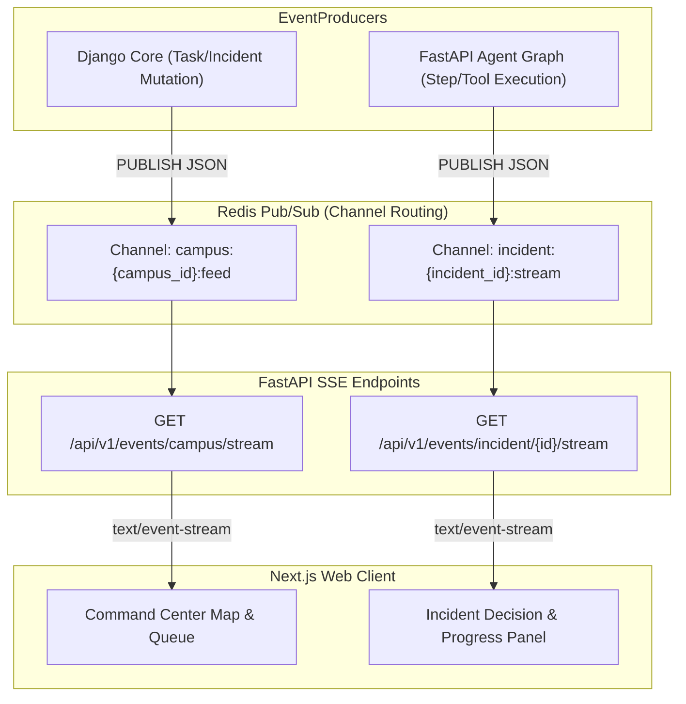

# Realtime Architecture — Paraxis AI

> **Purpose**: Real-time event propagation, Server-Sent Events (SSE) streaming, Redis pub/sub channel taxonomy, and UI state synchronization.

---

## 1. Real-Time Telemetry Design

The Command Center and Student UI require instant operational feedback without polling. We utilize **Server-Sent Events (SSE)** driven by a Redis Pub/Sub backbone.



---

## 2. Channel Taxonomy & Payload Contracts

### 2.1 Campus-Wide Operational Feed (`campus:{campus_id}:feed`)
Broadcasts high-level state transitions visible to operational staff:
```json
{
  "event_id": "evt_98432a1",
  "event_type": "TASK_DISPATCHED",
  "campus_id": "c1f7a012-...",
  "incident_id": "inc_4810...",
  "timestamp": "2026-09-11T12:00:00Z",
  "payload": {
    "title": "Wi-Fi Outage in Block B, Room 204",
    "department": "IT_NETWORK",
    "priority": "MEDIUM",
    "assignee": "Ramesh K."
  }
}
```

### 2.2 Incident Agent Reasoning Stream (`incident:{incident_id}:stream`)
Broadcasts real-time step summaries as LangGraph processes the incident:
```json
{
  "event_id": "evt_1092a",
  "event_type": "AGENT_STEP_COMPLETED",
  "step_name": "contextualize",
  "incident_id": "inc_4810...",
  "timestamp": "2026-09-11T12:00:02Z",
  "payload": {
    "summary": "Resolved location: Block B, Room 204. Identified Asset AP-04.",
    "evidence": ["AP-04 signal drop recorded 15m ago", "Room capacity: 60 students"],
    "action_proposed": "CREATE_TASK"
  }
}
```

> [!IMPORTANT]
> **No Raw Chain-of-Thought**: SSE payloads deliver structured operational summaries and concrete evidence, never unformatted model stream tokens or internal prompts.
