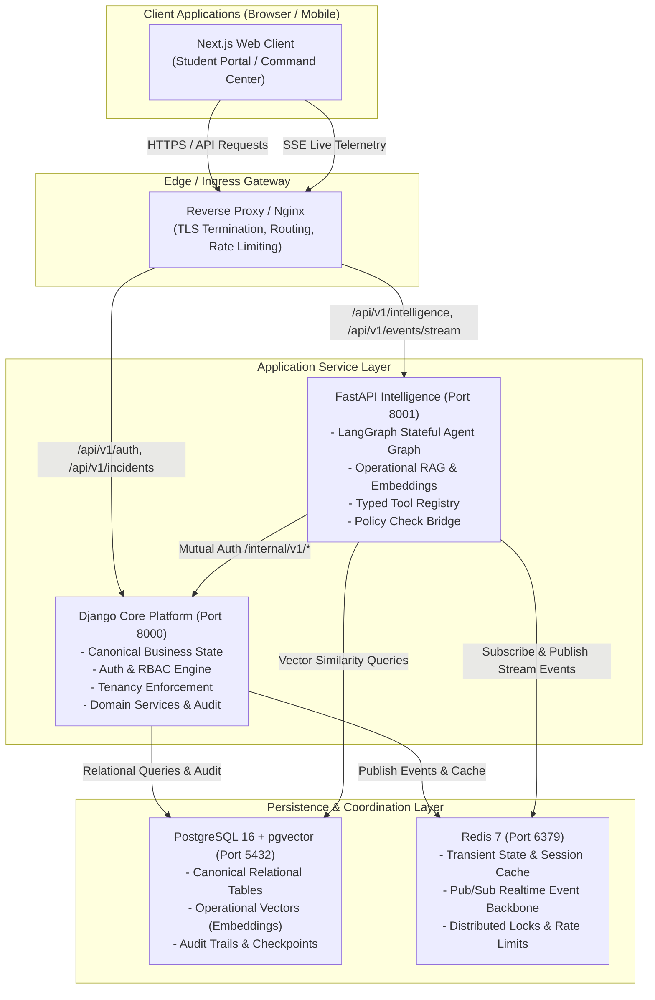

# System Overview — Paraxis AI Architecture

> **Purpose**: High-level structural topology, architectural invariants, service boundaries, and cross-cutting capabilities of Paraxis AI.

---

## 1. Executive Summary & Vision

Paraxis AI is **"The Intelligent Operational Layer for Modern Campuses"**. Campuses currently struggle with fragmented point solutions: student ticketing portals that lead to dead queues, uncoordinated maintenance teams, opaque hostel/mess management, and uncoordinated safety responses. 

Paraxis AI acts as a coordinating operational layer that:
1. Ingests operational inputs across natural language, scheduled telemetry, and manual staff inputs.
2. Contextualizes inputs against a rich campus physical and organizational graph.
3. Coordinates remediation workflows through deterministic policy gates and typed tools.
4. Monitors SLAs and auto-escalates bottlenecks.
5. Retains operational memory to uncover systemic failures before they disrupt campus life.

---

## 2. Global Architecture Diagram

---

## 3. Service Boundaries & Separation of Concerns

### 3.1 Django Core Platform (`backend/core`)
- **Role**: Sovereign authority over business state.
- **Boundaries**:
  - Handles all user authentication and token issuance.
  - Enforces Organization and Campus multi-tenancy.
  - Maintains domain data integrity for Assets, Locations, Incidents, Tasks, SLAs, and Approvals.
  - Records append-only immutable `AuditLog` entries for all state transitions.
  - Exposes `/api/v1/` for external client requests and `/internal/v1/` for authenticated service calls.

### 3.2 FastAPI Intelligence (`backend/intelligence`)
- **Role**: Stateful cognitive reasoning and agent orchestration.
- **Boundaries**:
  - Executes LangGraph workflows triggered by incident creation or updates.
  - Manages AI provider abstraction (Google Gemini, OpenAI, Anthropic, Mock).
  - Executes semantic similarity search against `pgvector` for policy and duplicate detection.
  - Evaluates proposed actions against the deterministic Policy Engine.
  - Streams operational step updates to clients via Server-Sent Events (SSE).
  - **Inviolable Constraint**: Never writes directly to Django's relational tables. Requests all persistent mutations through authenticated internal Core APIs.

---

## 4. Cross-Cutting Architectural Patterns

1. **Defense-in-Depth AI Safety**: Untrusted user inputs are strictly isolated from agent instructions. Agents cannot execute raw SQL, shell commands, or unmonitored external network requests.
2. **Correlation & Observability**: Every operation carries five correlation identifiers across all service boundaries:
   - `request_id`: Traces client HTTP lifecycle.
   - `trace_id`: OpenTelemetry distributed trace ID.
   - `tenant_id`: Identifies `Organization` and `Campus`.
   - `agent_run_id`: Uniquely tracks LangGraph execution instances.
   - `tool_call_id`: Identifies specific tool execution requests.
3. **Deterministic Human-in-the-Loop**: Actions requiring financial commitments, safety alerts, or disciplinary changes are intercepted by the Policy Engine and placed into a pending approval state before execution.
