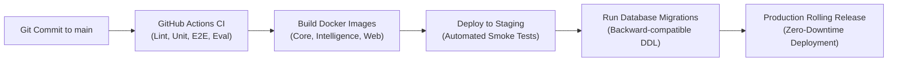

# Production Deployment Guide — Paraxis AI

> **Purpose**: Container build processes, database migration execution, and rolling zero-downtime release protocols.

---

## 1. Release Progression & Pipeline

---

## 2. Zero-Downtime Migration Rules

To ensure zero downtime during database schema updates:
1. **Never rename columns directly**: Add a new column, dual-write in application code, backfill data, and deprecate the old column.
2. **Add columns as Nullable**: Never add non-null columns without defaults to active tables.
3. **Run migrations before application boot**: Migration tasks execute as a pre-deploy job before new container pods receive live traffic.
