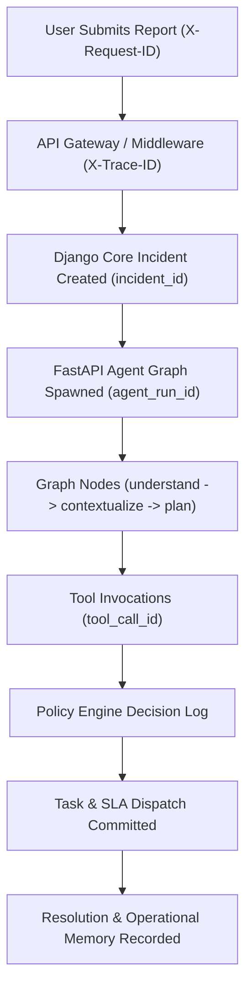

# Observability & Distributed Tracing — Paraxis AI

> **Purpose**: End-to-end traceability, distributed tracing headers, structured logging standards, and metrics collection.

---

## 1. Traceability Pipeline

Paraxis AI provides continuous, end-to-end correlation across the entire operational lifecycle:



---

## 2. Standard Correlation Identifiers

Every log message, HTTP request, and telemetry span MUST propagate these five canonical correlation fields:

| Header / Field | Origin | Purpose |
| :--- | :--- | :--- |
| **`request_id`** (`X-Request-ID`) | Edge Ingress / Web Client | Correlates a single HTTP request lifecycle. |
| **`trace_id`** (`X-Trace-ID`) | OpenTelemetry SDK | Correlates distributed operations across multiple microservices. |
| **`incident_id`** | Django Core | Uniquely identifies the operational incident across all services. |
| **`agent_run_id`** (`X-Agent-Run-ID`) | FastAPI Intelligence | Identifies an execution instance of the LangGraph state machine. |
| **`tool_call_id`** (`X-Tool-Call-ID`) | FastAPI Agent Engine | Identifies a specific tool execution request. |

---

## 3. Structured Logging Standards

Logs are formatted in structured JSON:
```json
{
  "timestamp": "2026-09-11T12:00:01.234Z",
  "level": "INFO",
  "service": "intelligence",
  "logger": "agent.nodes.policy_gate",
  "message": "Policy engine evaluated action",
  "trace_id": "4bf92f3577b34da6a3ce929d0e0e4736",
  "request_id": "req_98a712f4",
  "incident_id": "inc_718a209b",
  "agent_run_id": "run_019a84b1",
  "context": {
    "action_type": "CREATE_TASK",
    "verdict": "ALLOW",
    "reason": "Routine IT dispatch",
    "latency_ms": 12.4
  }
}
```

---

## 4. Logging Safety Invariants

### Strictly Permitted in Logs:
- Entity IDs (`incident_id`, `task_id`, `asset_id`).
- High-level decision summaries and rule IDs.
- Latency, token counts, and HTTP status codes.

### Strictly PROHIBITED from Logs:
- ❌ User passwords, auth secrets, or JWT tokens.
- ❌ Raw API keys (`GOOGLE_API_KEY`, `OPENAI_API_KEY`).
- ❌ Full PII of students reporting sensitive safety cases.
- ❌ Raw LLM internal chain-of-thought tokens.
