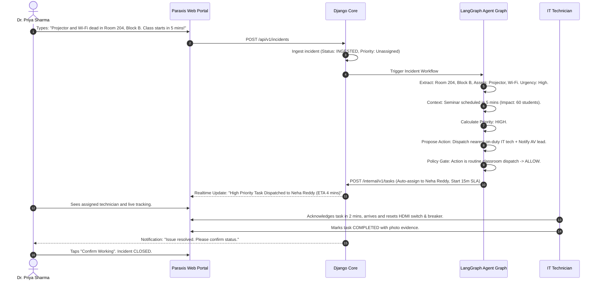

# User Journeys — Paraxis AI

> **Purpose**: Step-by-step operational workflows detailing human interactions, system automations, and agent checkpoints across core user journeys.

---

## 1. Journey A: Reporting and Auto-Resolving a Classroom IT Failure

- **Actor**: Dr. Priya Sharma (Faculty)
- **Context**: 5 minutes before CS301 begins in Room 204. The projector and ceiling Wi-Fi are unresponsive.

---

## 2. Journey B: Duplicate Detection and Incident Clustering

- **Actors**: Multiple students in Hostel Block B
- **Scenario**: A central fiber switch trips, disconnecting Wi-Fi across floors 2 and 3.

1. **Student 1 (Room 201)** reports: *"Internet is not working in 201."*
   - Paraxis creates master incident `INC-101`, contextualizes to Floor 2 Switch, dispatches Network Team.
2. **Student 2 (Room 204)** reports: *"Wi-Fi down in Block B Room 204."*
   - Agent graph calculates spatial-temporal similarity: same building (Block B), same timeframe (< 10 mins apart), same category (Wi-Fi).
   - Agent identifies `INC-101` as master incident.
   - Action proposed: `LINK_DUPLICATE`.
   - Policy evaluates `LINK_DUPLICATE` -> `ALLOW`.
   - Student 2's incident is marked `DUPLICATE_LINKED` to `INC-101`.
   - Student 2 receives notification: *"We are already actively addressing a network outage in Block B (Assigned to IT Team). Tracking master incident INC-101."*
3. **Operational Result**: Zero duplicate dispatches. Technicians focus on one central repair.

---

## 3. Journey C: Sensitive Safety Case with Masked Identity

- **Actor**: Student reporting harassment
- **Scenario**: Confidential report submitted through the Safety & Trust module.

1. Student opens **Safety & Trust** reporting tab and checks *"Submit Confidentially"*.
2. Inputs incident details regarding an encounter near the library.
3. Django Core encrypts details into `SafetyCase` table:
   - Reporter user ID is hashed and masked.
   - Access permission restricted strictly to `safety:view_confidential`.
   - Excluded from public command center dashboards.
4. Designated Safety Officer receives encrypted high-priority alert.
5. Officer coordinates private check-in with the student via secure one-way messaging.
