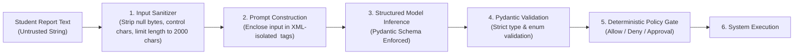

# AI Safety & Guardrail Model — Paraxis AI

> **Purpose**: Guardrails, input/output sanitization, hallucination mitigation, and prompt injection defenses in Paraxis AI.

---

## 1. Core AI Safety Principles

1. **Untrusted Input Quarantine**: Natural language reports are placed strictly in data payloads separated from system prompts.
2. **Schema-Constrained Generation**: The LLM cannot return freeform unstructured text to execute actions; all outputs must parse through strict Pydantic v2 schemas.
3. **No Sovereign Authority**: The LLM is an advisor, not an executive. Consequential actions must pass the deterministic Policy Engine.
4. **Zero Chain-of-Thought Exposure**: The UI displays verified operational evidence and action cards—never raw reasoning logs that might contain leaked prompt instructions.

---

## 2. Prompt Injection Defense Pipeline

---

## 3. Hallucination Mitigation

- **Entity Grounding**: When an agent extracts an entity (e.g., `Building: Block B`, `Room: 204`), the system performs an immediate database verification against the physical campus graph. If the room does not exist, the agent cannot dispatch to it.
- **Fact vs. Inference Labeling**: Every insight produced by the operational memory engine clearly tags factual counts vs. inferential suggestions to prevent operators from acting on ungrounded model assumptions.
