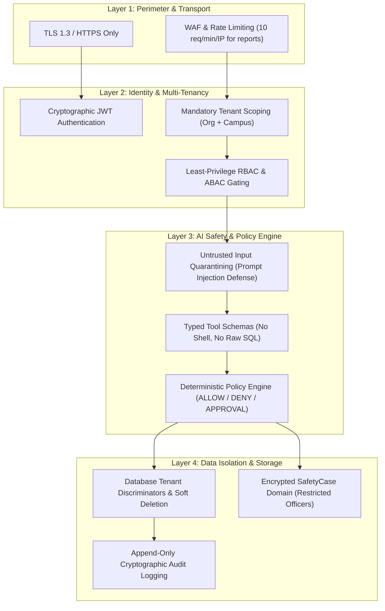

# Security Architecture — Paraxis AI

> **Purpose**: Defense-in-depth security model, architectural boundaries, cryptographic controls, and platform trust invariants.

---

## 1. Defense-in-Depth Architecture

---

## 2. Core Security Invariants

1. **Untrusted User Input**: All text submitted by students, staff, or ingested from external sources is untrusted. It is never concatenated directly into prompt system instructions.
2. **Untrusted AI Output**: All LLM completions are treated as untrusted suggestions until parsed through Pydantic validators and verified by the Policy Engine.
3. **No Direct Production Database Writes from FastAPI**: The intelligence platform communicates with Django Core via authenticated internal service APIs with HMAC signatures and request correlation tokens.
4. **Tenant Isolation Invariant**: No query may execute against multi-tenant tables without explicit `campus_id` filtering.
