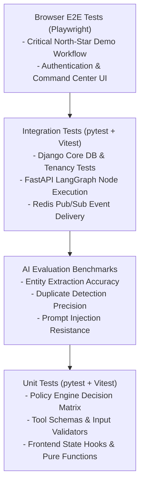

# Testing Strategy & Quality Assurance — Paraxis AI

> **Purpose**: Testing pyramid, tooling standards, coverage requirements, and continuous quality gates for Paraxis AI.

---

## 1. The Paraxis Testing Pyramid

---

## 2. Tooling & Framework Standards

| Test Tier | Framework / Tool | Location | Execution Target |
| :--- | :--- | :--- | :--- |
| **Backend Unit & Integration** | `pytest`, `pytest-django`, `pytest-asyncio` | `tests/integration/`, `apps/core/tests/`, `apps/intelligence/tests/` | Sub-second fast feedback in CI. |
| **Frontend Unit & Component** | `Vitest`, `@testing-library/react` | `apps/web/__tests__/` | Fast DOM assertions. |
| **End-to-End (E2E)** | `Playwright` | `tests/e2e/` | Headless Chromium browser user journeys. |
| **Contract & Schema** | `pydantic`, `schemathesis` | `tests/contract/` | Validates OpenAPI & event payload contracts. |
| **AI Evaluation Benchmarks** | Custom Python Evaluation Harness | `tests/evaluation/` | Offline regression runs with gold datasets. |

---

## 3. Code Coverage & Quality Targets
- **Core Domain & Policy Engine**: Minimum **90% line coverage**.
- **Agent Tools & Validators**: Minimum **95% branch coverage**.
- **Overall Codebase**: Minimum **80% overall test coverage**.
- Zero tolerance for skipped or weakened test assertions.
